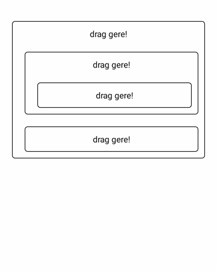
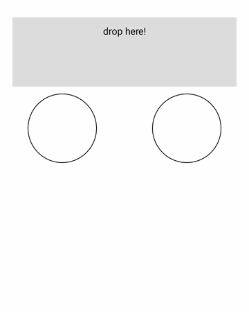
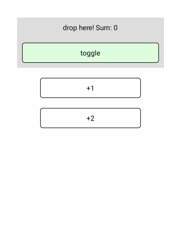
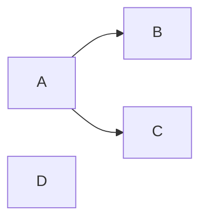

# Overview

This library is a declarative drag-and-drop system for React Native, written in TypeScript.  It is designed to be flexible and powerful with the goal of supporting many use cases. Default settings should cover the most common scenarios with minimal configuration.

# Screenshots
 
  
### More screenshots

<details>  
<summary>More screenshots</summary>
  
 
</details>

### Snack
There is [an example on snack](https://snack.expo.dev/@narfuls/react-native-nested-drag-example) though it works fine only on real device.

# Installation

```n
npm i react-native-nested-drag
```

### or using yarn

```
yarn add react-native-nested-drag
```

# Usage
Import the library components:
```ts
import { DragView, DropView, DragProvider } from 'react-native-nested-drag'
```

## Basic example
```jsx
<DragProvider>
  <DropView>
    <Text>drop here!</Text>
  </DropView>
  <DragView>
    <Text>drag me</Text>
  </DragView>
</DragProvider>
```

## DragProvider
Wrap the part of your application that you want to enable drag and drop for inside ```DragProvider```.
```jsx
<DragProvider>
  {/*  */}
</DragProvider>
```
### Props
All props are optional.
| Prop          | Type       | Default       | Description   |      
| ------------- | ---------- | ------------- | ------------- |
| `mockEventManager` | [`IDndEventManager`](./src/types.ts#L90) | | Only for testing |
| `overlapMode` | [`OverlapMode`](./src/types.ts#L151) | 'last' | Specifies events call order when multiple `DropView` in same area. After sorting with comparer, `DropView` events will be called last to first. **You can't change it dynamically.**|

## DragView
The element that you want to make draggable.

 *The `DragView` won't be actually dragged, instead a copy appears on `DragStart` to make sure element always on top.*
```jsx
      <DragView payload={1}>
        <View style={styles.itemContainer}>
          <Text>+1</Text>
        </View>
      </DragView>
```

### Props
All props are optional.

| Prop          | Type       | Default       | Description   |      
| ------------- | ---------- | ------------- | ------------- |
| `payload` | `any` | | An arbitrary value (often) unique to this draggable that can later be used to determine which draggable item was dropped onto a droppable |
| `style` | `ViewStyle` |  | Style applied while this view is **NOT** being dragged |
| `dragStyle` | `ViewStyle` |  | Style applied while this view is being dragged |
| `overStyle` | `ViewStyle` |  | Style applied while this view is being dragged over a receiver |
| `copyDragStyle` | `ViewStyle` |  | Style applied to the copy while this view is being dragged |
| `copyOverStyle` | `ViewStyle` |  | Style applied to the copy while this view is being dragged over a receiver |
| `disabled` | `boolean` | false | Specifies whether this view can be dragged |
| `longPressDelay` | `number` | 0 | Time interval in ms after which this view can be dragged |
| `vibroDuration` | `number` | 0 | Vibration duration **on drag start** in ms |
| `movable` | `boolean` | false | Specifies whether this view stays where it has been dragged |
| `movableOffset` |  [`IPosition`](./src/types.ts#L66) | `{x:0,y:0}` | It useful only when you want nested `movable` `DragView` appear correctly inside the draggable copy or for restoring movable state. This prop shouldn't be used just for formatting  |
| `onDragStart` |  [`DraggableDragStart`](./src/types.ts#L32) |  | Callback that is triggerd when user starts dragging the `DragView` |
| `onDrag` |  [`DraggableDragStart`](./src/types.ts#L32) |  | Callback that is triggered repeatedly when user dragging the `DragView` **not over** any receiver |
| `onEnter` |  [`DraggableEnterOver`](./src/types.ts#L28) |  | Callback that is triggered when the `DragView` initially dragged over a new receiver  |
| `onOver` |  [`DraggableEnterOver`](./src/types.ts#L28) |  | Callback that is triggered repeatedly when the `DragView` dragged over a receiver  |
| `onExit` |  [`DraggableExit`](./src/types.ts#L30) |  | Callback that is triggered when the `DragView` leaves the droppable area  |
| `onDragEnd` |  [`DraggableEnd`](./src/types.ts#L34) |  | Callback that is triggered when the `DragView` drag ends not over any receiver or is cancelled  |
| `onDrop` |  [`DraggableDrop`](./src/types.ts#L36) |  | Callback that is triggered when the `DragView`  drag ends over a receiver  |
| `animationEndOptions` |  [`ISpringAnimationConfig`](./src/types.ts#L199) | `{ overshootClamping: true}` | `Animated.SpringAnimationConfig` to customize dragEnd animation |
| `animationDropOptions` |  [`ITimingAnimationConfig`](./src/types.ts#L187) |  | `Animated.TimingAnimationConfig` to customize dragEnd animation |

## DragHandleView
`DragHandleView` is useful when you want to restrict area where drag can start. 

Just place one or more inside `DragView`.
Notice that `Button` and `TouchableOpacity` work inside `DragView` and also restrict possible drag start area (you can't start drag on buttons).

```jsx
    <DragView>
        <Text>part 1</Text>
        <DragHandleView style={styles.handle}>
          <Text>drag here!</Text>
        </DragHandleView>
    </DragView>
```
### Props
All props are optional.
| Prop          | Type       | Default       | Description   |      
| ------------- | ---------- | ------------- | ------------- |
| `style` | `ViewStyle` |  | Style applied just like plain View |


## DropView
The element that you want to receive droppable events.

```jsx
  const drop = (_, payload) => {
    console.log(payload)
  }
  //...
  
    <DropView onDrop={add}>
      <Text>drop here!</Text>
    </DropView>
```
### Props
All props are optional.
 
| Prop          | Type       | Default       | Description   |      
| ------------- | ---------- | ------------- | ------------- |
| `payload` | `any` | | An arbitrary value (often) unique to this `DropView` that can later be used to determine in which `DropView` the `DragView` was dropped to |
| `style` | `ViewStyle` |  | Style applied while over this `DropView` is **NOT** dragging a `DragView` |
| `overStyle` | `ViewStyle` |  | Style applied while dragging a `DragView` over this `DropView`  |
| `disabled` | `boolean` | false | Specifies whether this view receives DnD events |
| `onEnter` |  [`DroppableEnterExit`](./src/types.ts#L24) |  | Callback that is triggered when a `DragView` initially dragged over this `DropView`  |
| `onOver` |  [`DroppableDropOver`](./src/types.ts#L26) |  | Callback that is triggered repeatedly when a `DragView` dragged over this `DropView` |
| `onExit` |  [`DroppableEnterExit`](./src/types.ts#L24) |  | Callback that is triggered when a `DragView` leaves this `DropView`  |
| `onDrop` |  [`DroppableDropOver`](./src/types.ts#L26) |  | Callback that is triggered when a `DragView`  dragging ends over this `DropView`  |

# Testing

Import the library components:

```ts
import { DragProvider, MockDndEventManager } from 'react-native-nested-drag'
```

Create  mockEventManager:

```ts
const mockEventManager = new MockDndEventManager()
```
Wrap your component for test render:
```jsx
<DragProvider mockEventManager={mockEventManager}>
  <YourComponent>
</DragProvider>
```

Call DnD action like so:
```ts
mockEventManager.drop(mockEventManager.draggables[0], mockEventManager.droppables[0])
```

If you have animation errors set before the action:
```ts
jest.mock('react-native/Libraries/Animated/NativeAnimatedHelper')
jest.useFakeTimers()
```

[Full example with 'testing-library/react-native'](./example/components/DropSum.spec.tsx)

## License

This software library is licensed under the [MIT License](LICENSE.md).

## Caveats and tips

* If nested elements rendered base on own state clone appears as initial state. Possible workaround is move that state outside ```DragProvider``` (e.g. state management library).

* If you want to store offset for ```movable``` ```DragView``` (may be because previous point) ```onDragEnd``` and ```onDrop``` receives it as parameter.

* Don't put these styles on ```DragView``` (if necessary add ```View``` inside or outside):
  - ```margin```
  - ```transform```
  - ```position```
  - ```opasity``` (allowed for ```dragStyle``` and ```overStyle``` only)

* % ```width``` style doesn't work well in many cases.

* There is ```useEffect``` listeners on props so make sure your props won't change on every render.
<details>  
<summary>For example:</summary>
  
instead
```ts
...movableOffset={{x:50, y:-10}}...
```

use
```ts
...
const [movableOffset] = useState({x:50, y:-10});

...movableOffset={movableOffset}...
```
</details>

* Available option for overlap handling is `next callback` (for ```onDrop``` and ```onOver```)

* Overlapping ```DropView``` is tricky especially when nested.
<details>  
<summary>Explanation</summary>
Droppables is plain array registered on first render so if on screen they are:
  

  
where B and C nested to A.
  
Droppables order: [B, C, A, D]
  
Moreover if you are using dynamic 'disabled' prop, which causes unregister order may become completely unpredictable.
  
You may try to use next callback or comparer function for `overlapMode` but much easier just avoid overlapping whenever it's possible.

</details>


* ```onLayout``` event probably still  calls only once (when component renders first time) inside ```DragView``` and ```DropView``` (also don't use it inside 'View' with ```onLayout``` if elements may change positions on screen besides dragging.)
